# 🚀 Fully Automated Zero‑Downtime Deployment on AWS (Terraform + GitHub Actions)

This repository demonstrates a **production‑style, fully automated deployment pipeline** that takes your application from **code push → tested → built → versioned → deployed** on AWS with **zero downtime**.

Everything is automated. No manual SSH. No manual deploys. No clicking in the AWS Console.

---

## 🧩 High‑Level Story

> *“When code reaches `main`, it is already tested, built, versioned, published, and safely deployed without interrupting users.”*

Here’s the journey:

1. A developer pushes code to GitHub
2. GitHub Actions runs tests and builds the application
3. A **Git tag version** is generated (e.g. `v1.3.2`)
4. Docker images are built and pushed to:

   * Docker Hub (private)
   * Amazon ECR
5. The **latest version tag** is written to **AWS SSM Parameter Store**
6. EC2 instances continuously watch that parameter
7. When the version changes:

   * EC2 pulls the new image from ECR
   * Runs it alongside the old one
   * Switches traffic safely
8. Users never experience downtime 🎉

---

## 🏗️ Infrastructure (Terraform)

All infrastructure is created and managed using **Terraform**.

### AWS Resources Created

* **Networking**

  * VPC
  * 2 Public Subnets (Multi‑AZ)
  * 2 Private Subnets (Multi‑AZ)
  * Internet Gateway
  * NAT Gateway
  * Route Tables & Routes

* **Compute & Access**

  * EC2 instance (private subnet)
  * IAM Role for EC2 (ECR + SSM access)
  * Instance Profile attachment

* **Load Balancing**

  * Application Load Balancer (public)
  * Listener
  * Target Group
  * Health checks to the application port

* **Security**

  * Security Group for ALB (internet‑facing)
  * Security Group for EC2 (internal traffic only)

* **Configuration Management**

  * AWS SSM Parameter (stores the active image tag)

---

## 🖼️ Architecture Diagram

```mermaid
graph TD
    User[🌍 Internet User]
    User --> ALB[⚖️ Application Load Balancer]

    ALB --> EC2[🖥️ EC2 Instance]

    EC2 --> ECR[📦 Amazon ECR]
    EC2 --> SSM[🔐 SSM Parameter Store]

    GitHub[🐙 GitHub Repo]
    GitHub --> Actions[⚙️ GitHub Actions]
    Actions --> ECR
    Actions --> SSM
```

---

## 🔁 CI/CD Pipeline (GitHub Actions)

### 1️⃣ Pull Request Phase

* Code is pushed to a feature branch
* GitHub Actions runs:

  * ✅ Tests
  * ✅ Build checks

❌ If **build fails** → merge blocked (cannot bypass)
⚠️ If **tests fail** → merge blocked (can be bypassed manually)

---

### 2️⃣ Merge to `main`

Once merged:

1. Tests run again
2. Application is built
3. A **Git version tag** is generated
4. Docker images are built
5. Images are pushed to:

   * Docker Hub (private)
   * Amazon ECR
6. AWS SSM Parameter is updated with the new version tag

This tag becomes the **single source of truth** for deployments.

---

## 🚢 Deployment on EC2 (Zero Downtime)

### First Deployment (Infrastructure Creation)

* Terraform creates EC2
* User‑data script:

  * Installs Docker, AWS CLI, cron
  * Creates a deployment script
  * Pulls the **current image tag** from SSM
  * Runs the container

---

### Continuous Deployment (No Rebuild, No Recreate)

On EC2:

* A systemd service + cron job runs a deploy script
* Every few minutes:

  1. Reads the image tag from SSM
  2. Compares it with the running version
  3. If changed:

     * Pulls the new image from ECR
     * Stops the old container
     * Starts the new one

✨ No EC2 recreation
✨ No Terraform re‑apply
✨ No SSH

---

## 🛡️ Security Design

* EC2 is **not exposed to the internet**
* Only the ALB is public
* EC2 only accepts traffic from the ALB security group
* IAM role grants:

  * Read‑only access to ECR
  * Read access to SSM Parameter Store

---

## 🎯 Key Benefits

✅ Fully automated
✅ Infrastructure as Code
✅ Zero downtime deployments
✅ Safe rollouts using versioned images
✅ Production‑ready AWS architecture

---

## 📌 Future Improvements

* Auto Scaling Group instead of single EC2
* Blue/Green deployments
* Canary releases
* Observability (CloudWatch / Prometheus)
* HTTPS with ACM

---

## 🧠 Final Thought

This project shows how **modern DevOps** works in practice:

> *Code is the trigger. Automation does the rest.*

No clicks. No guesswork. Just reliable, repeatable deployments.

---

Happy shipping 🚀
